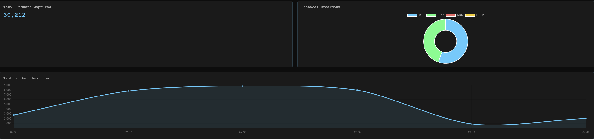

# 📡 Network Packet Analyzer

A real-time network packet capture and analysis tool built in Python. Captures live traffic on your network interface, parses it by protocol, stores it in a local database, and visualizes it through a web dashboard.

Built to demonstrate practical knowledge of networking fundamentals, packet analysis, and full-stack security tooling.

---

## 🖥️ Dashboard Preview

<!-- Add your screenshot here after taking one -->


---

## 🔍 What It Does

- Captures live packets from your network interface in real time
- Parses and categorizes traffic by protocol — DNS, HTTP, TCP, UDP
- Logs every packet with timestamp, source IP, destination IP, and details
- Displays a live web dashboard that refreshes every 5 seconds
- Shows protocol breakdown, top destinations, DNS queries, and a traffic timeline

---

## 🧠 What I Learned

- How DNS resolution works under the hood — every domain lookup your machine makes is visible, including background calls from apps you aren't actively using
- How HTTPS traffic appears at the packet level — you can see the connection but not the contents, which illustrates why encryption matters
- How much background traffic modern machines generate silently — apps phoning home, certificate validation checks (OCSP), telemetry, etc.
- How tools like Wireshark work at a fundamental level

---

## 🛠️ Tech Stack

| Tool | Purpose |
|------|---------|
| Python | Core language |
| Scapy | Packet capture and parsing |
| SQLite | Local packet storage |
| Flask | Dashboard web server |
| Chart.js | Frontend data visualization |

---

## ⚙️ How to Run It

### Prerequisites

- Python 3.x
- On Windows: [Npcap](https://npcap.com) installed with WinPcap compatibility mode enabled

### Install dependencies
```bash
pip install scapy flask
```

### Run the packet capture

Requires elevated privileges to access the network interface:
```bash
# Linux / Mac
sudo python3 analyzer.py

# Windows (run terminal as Administrator)
python analyzer.py
```

### Run the dashboard

In a second terminal:
```bash
python3 dashboard.py
```

Then open your browser to `http://localhost:5000`

---

## 📁 Project Structure
```
packet-analyzer/
├── analyzer.py          # Packet capture and parsing engine
├── dashboard.py         # Flask web server and API endpoints
├── templates/
│   └── index.html       # Dashboard frontend
├── requirements.txt     # Python dependencies
├── .gitignore
└── README.md
```

---

## 🔒 Privacy Note

This tool is intended for use on your own network only. Capturing traffic on networks you do not own or have explicit permission to monitor is illegal. The `packets.db` database file is excluded from this repo via `.gitignore` as it may contain sensitive network data.

---

## 🚀 Potential Improvements

- [ ] GeoIP lookup to map destination IPs to countries
- [ ] Flag traffic to known malicious IPs using a threat intelligence feed
- [ ] Protocol filter buttons on the dashboard
- [ ] CSV export of captured packets
- [ ] Docker support for easy deployment
- [ ] Alert system for sudden traffic spikes

---

## 👤 Author
EA - https://github.com/mkultraware
